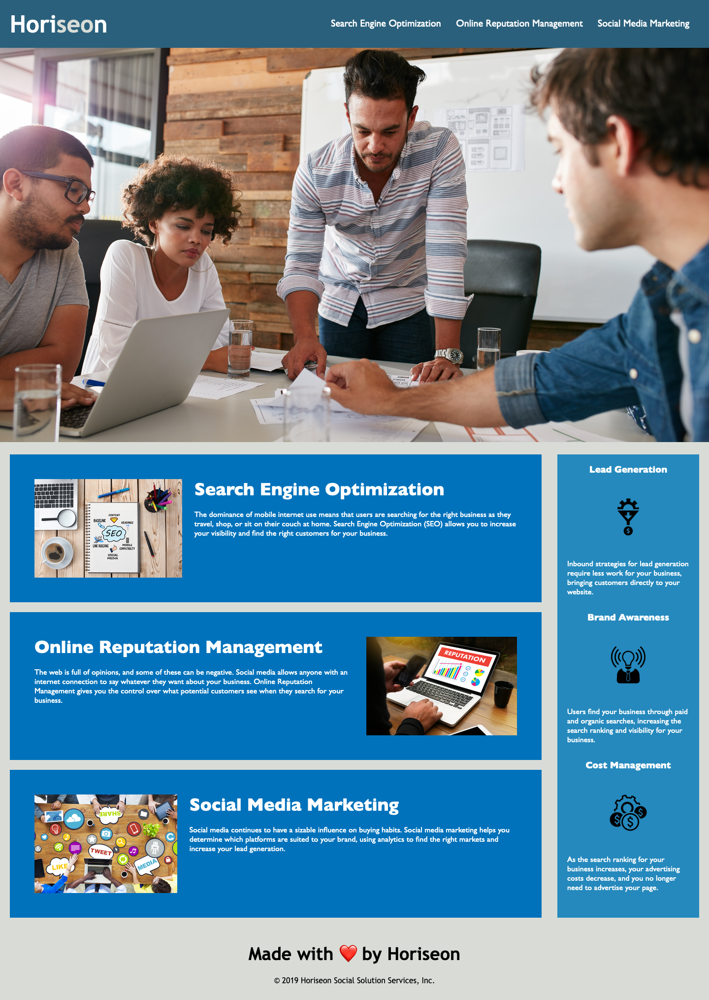

# Semantic HTML Assignment

## Objectives
Update web page DOM and debug issues regarding unresponsive links. Verify that the webpage is up to accessability standards.

### **HTML Updates**
* Added alternate text to images to bring site up to accessability standards.
* Fixed "searching-engine-optimization" by adding an #id of the same name.
* Updated document title to read "Horiseon"
* Added title to `<figure>` tag for alternate text.
* Updated content div tag to semantic tag `<main>`.
* Updated benefits div tag to semantic tag `<aside>`.
* Updated div inside the main and aside tags to semantic tag `<section>`.
* Updated hero div class to semantic tag `<figure>`.
* Removed all `class` tags from the content section.

### **CSS Updates**
* Some housekeeping with tags. Removed some, updated others to keep in step with semantic div changes.
* Updated `.class` tags in the content section to `#id`
* Consolidated content imgs tags into one `img` tag.
* Consolidated all `h2` tags.

To view the page, visit [Horiseon.](https://wulfsounds.github.io/semantic-html/)

A repo is available to view on [GitHub.](https://github.com/wulfsounds/semantic-html)

--------------------

## **Screenshots**

--------------------

